The benchmarks were run on an `11th Gen Intel(R) Core(TM) i5-11400 @ 2.60GHz` with 6 threads (hyperthreading off).  

All computations are done on column major matrices.

The plots are normalized so that the `faer` line is set to `1.0`.

Higher is better on all the plots.

Last updated: 2024-05-25

## f32

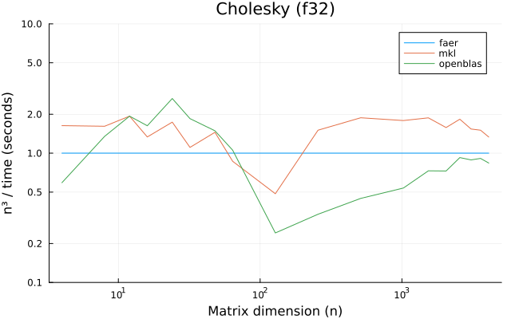

---

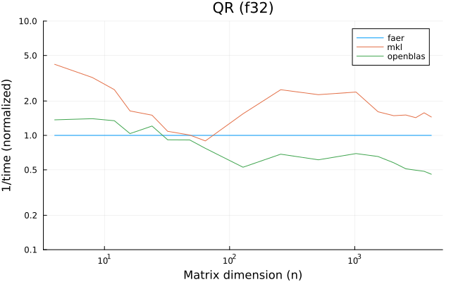

---

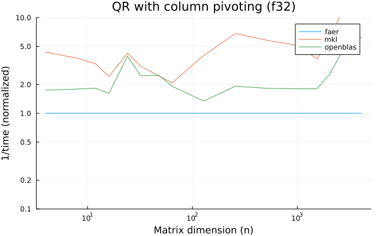

---

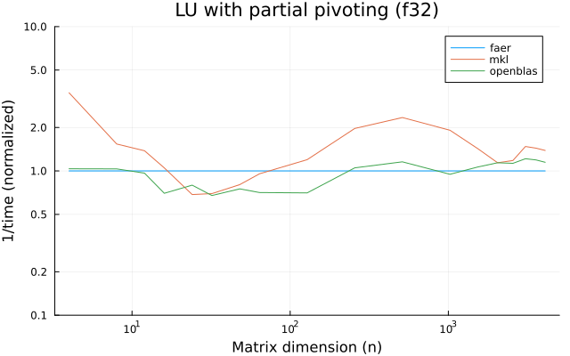

---

---

---

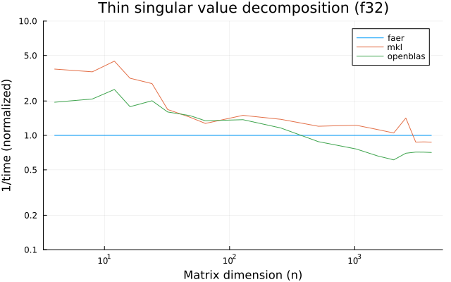

---

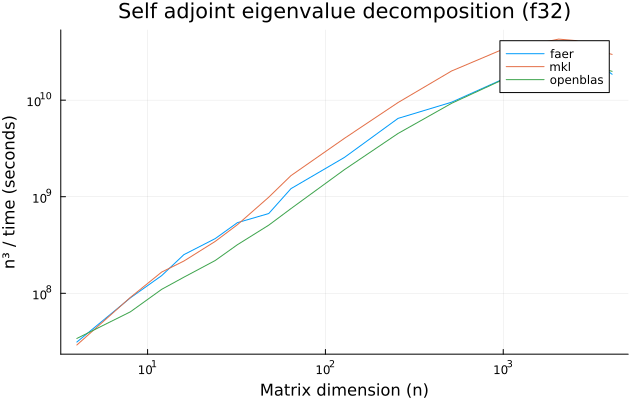

---

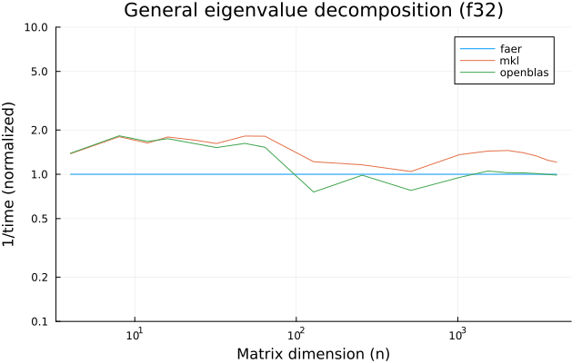

---

## f64

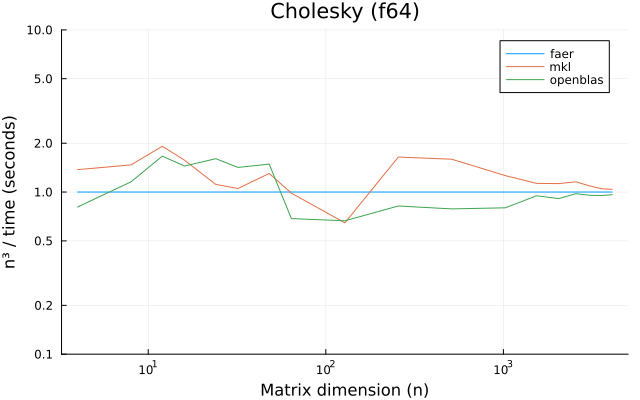

---

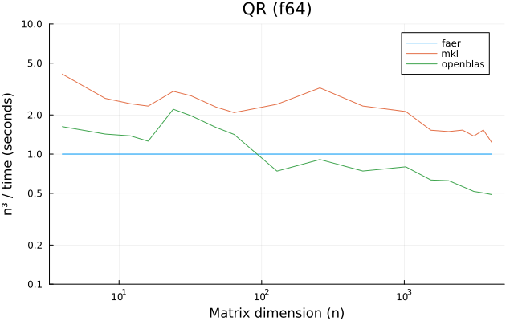

---

---

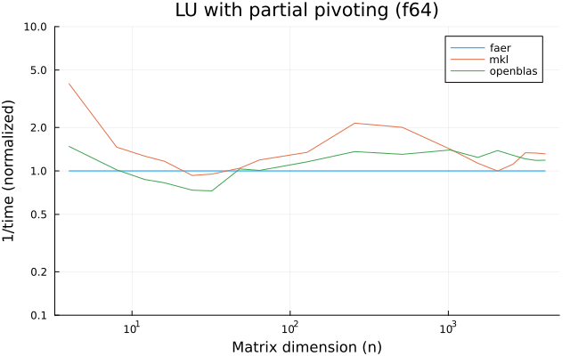

---

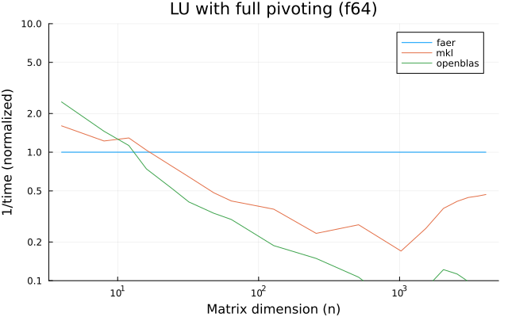

---

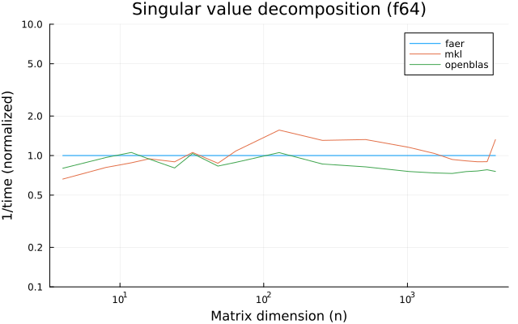

---

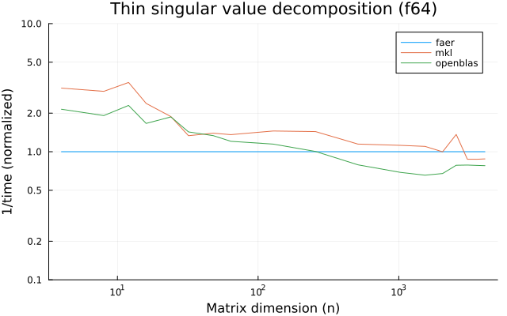

---

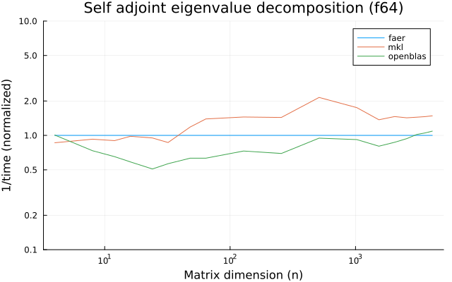

---

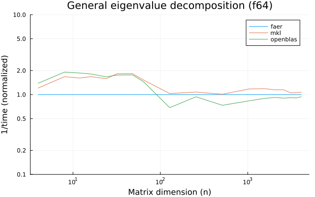

---

## c32

---

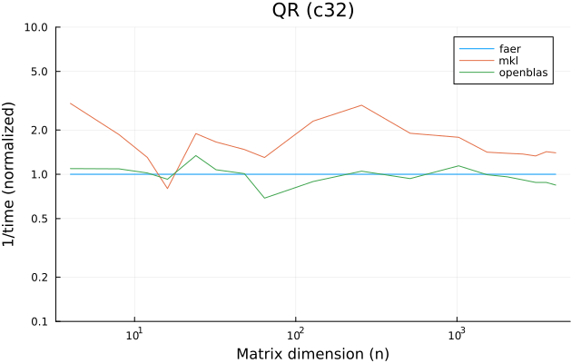

---

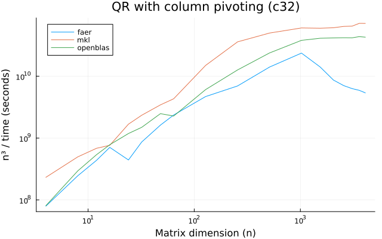

---

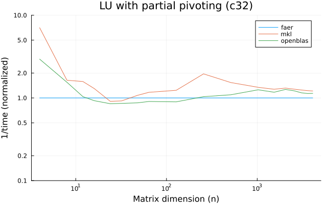

---

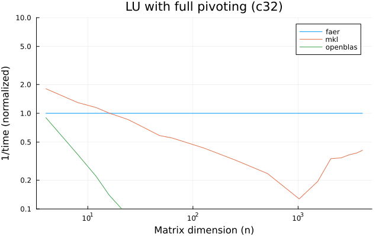

---

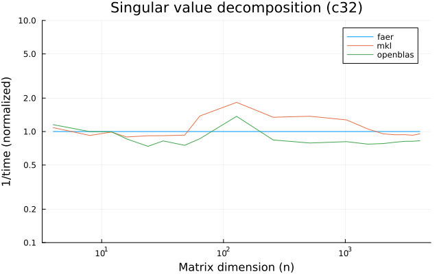

---

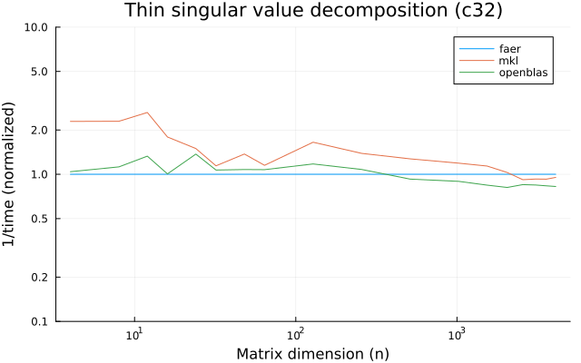

---

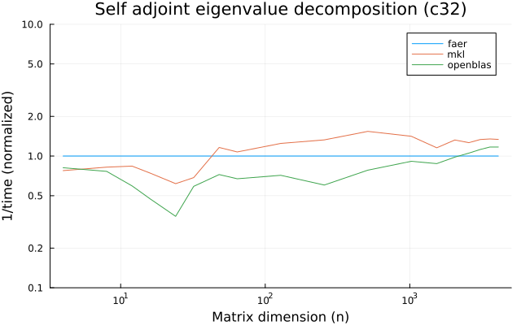

---

---

## c64

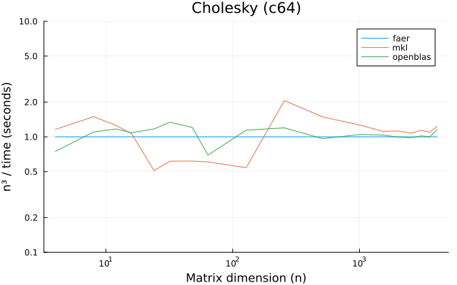

---

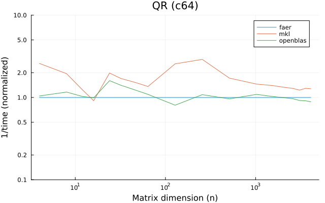

---

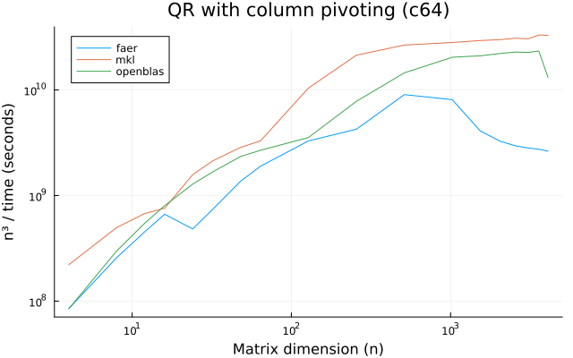

---

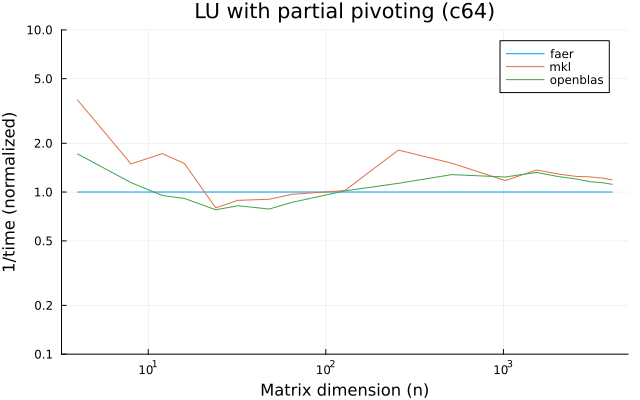

---

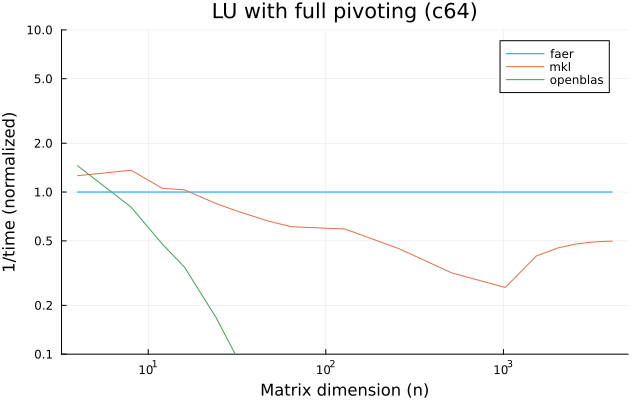

---

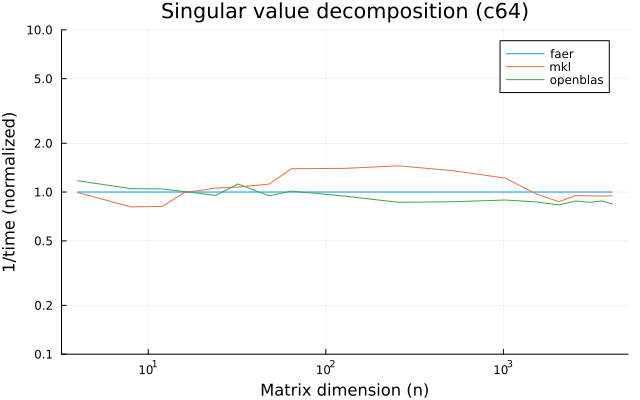

---

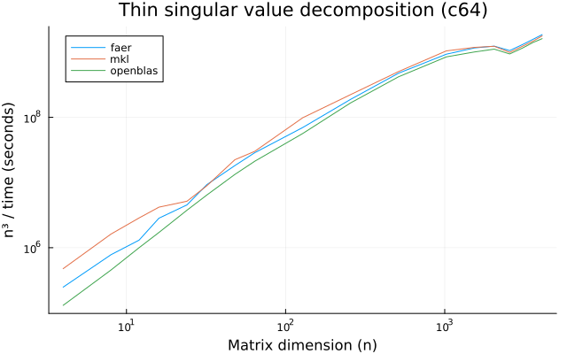

---

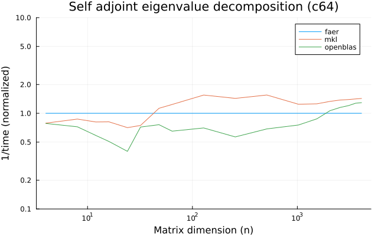

---

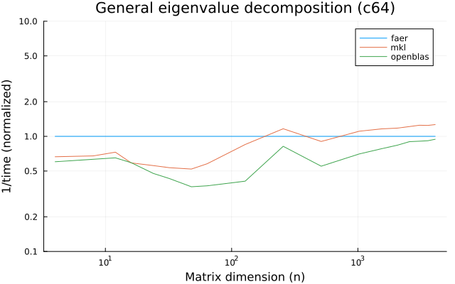

---
