the benchmarks were run on an `11th gen intel(r) core(tm) i5-11400 @ 2.60ghz` with 6 threads (hyperthreading off).  

all computations are done on column major matrices.

the plots are normalized so that the _`faer`_ line is set to `1.0`.

higher is better on all the plots.

last updated: 2024-05-25

## f32

---

---

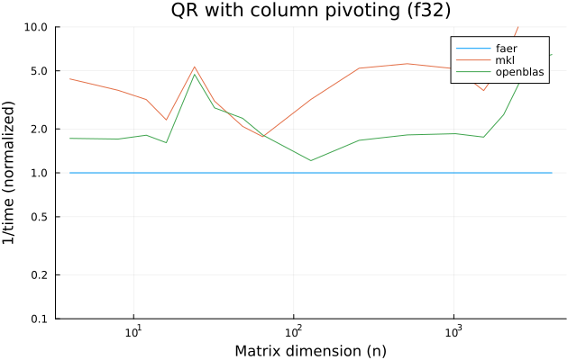

---

---

---

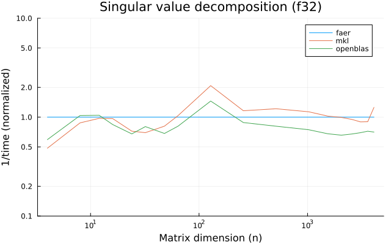

---

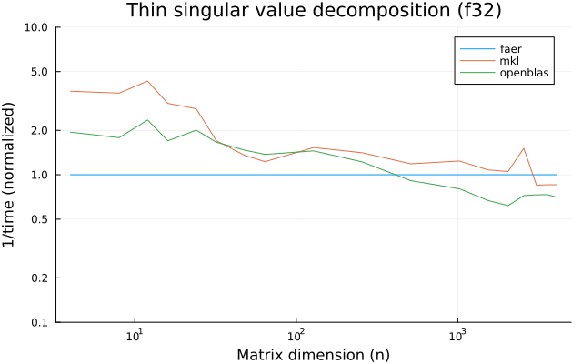

---

---

---

## f64

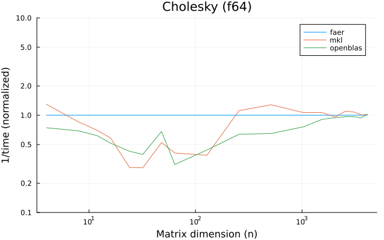

---

---

---

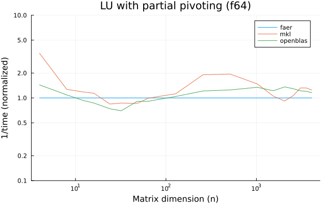

---

---

---

---

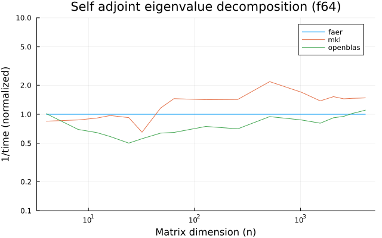

---

---

## c32

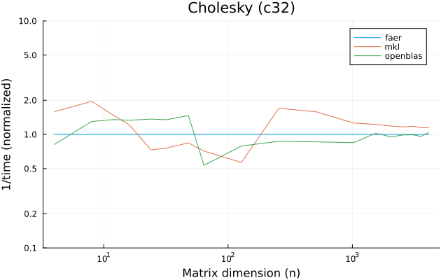

---

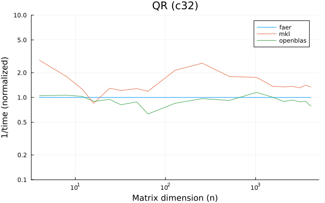

---

---

---

---

---

---

---

---

## c64

---

---

---

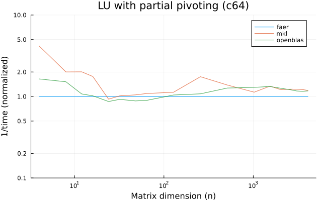

---

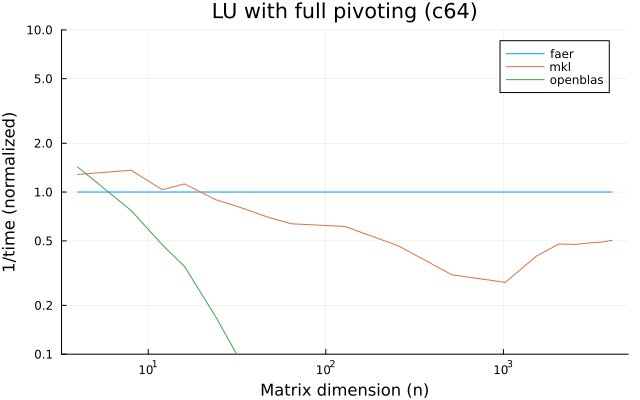

---

---

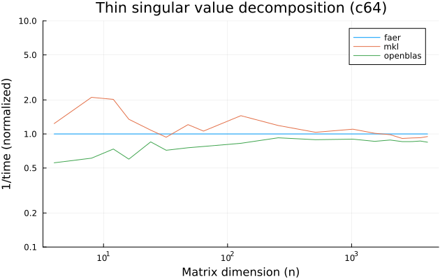

---

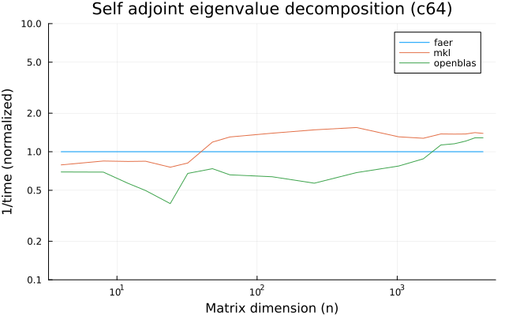

---

---
