The benchmarks were run on an `11th Gen Intel(R) Core(TM) i5-11400 @ 2.60GHz` with 1 thread (hyperthreading off).  

All computations are done on column major matrices.

Higher is better on all the plots.

## f32
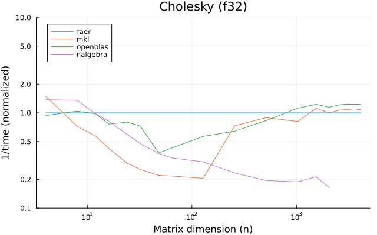 

---

---

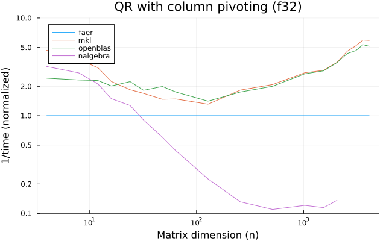

---

---

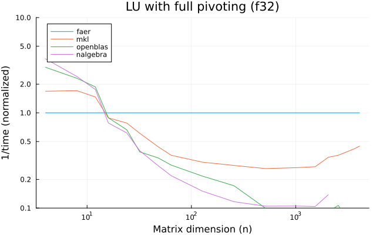

---

---

---

---

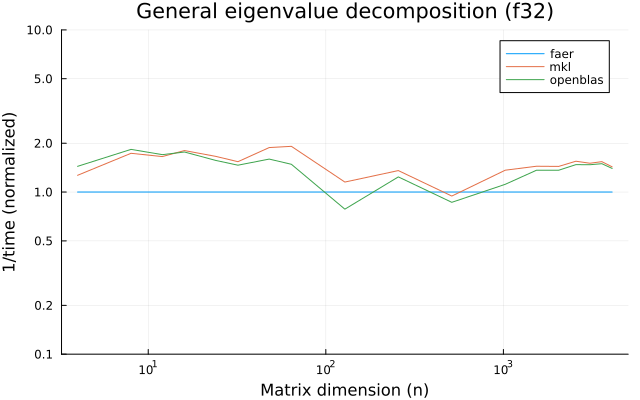

---

## f64

---

---

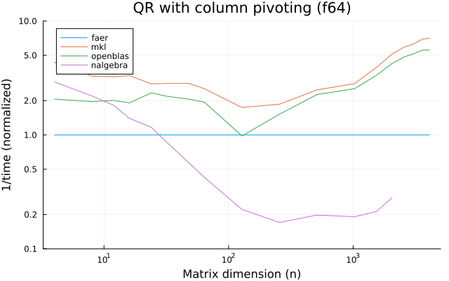

---

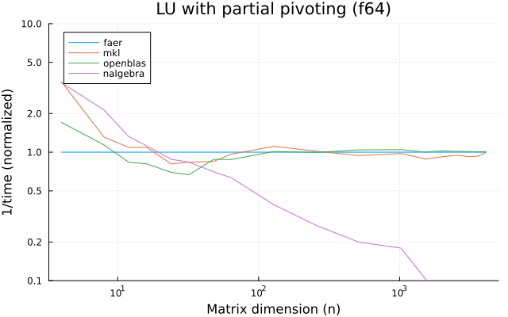

---

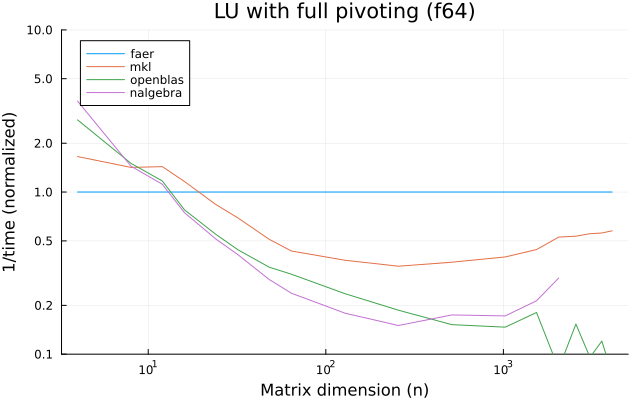

---

---

---

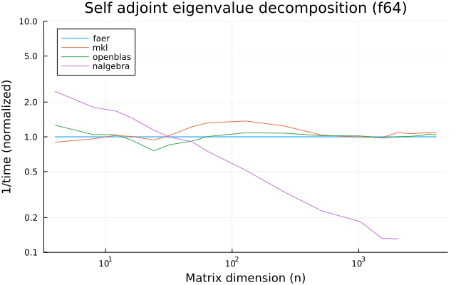

---

---

## c32

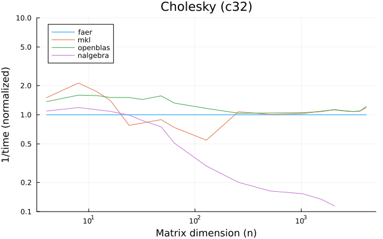

---

---

---

---

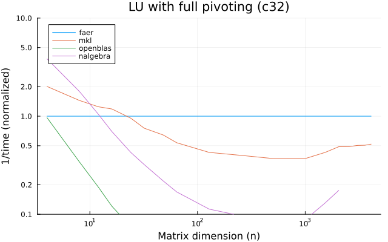

---

---

---

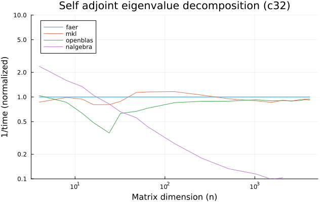

---

---

## c64

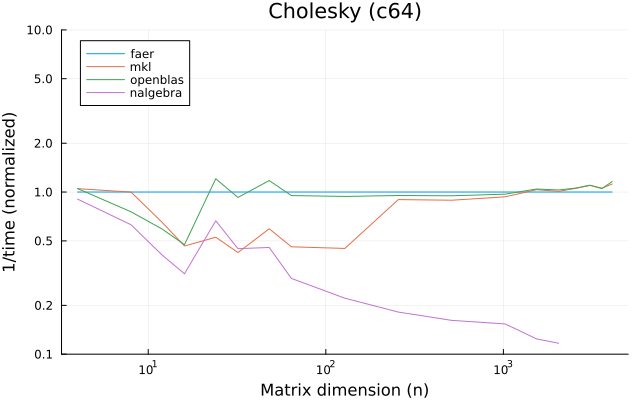

---

---

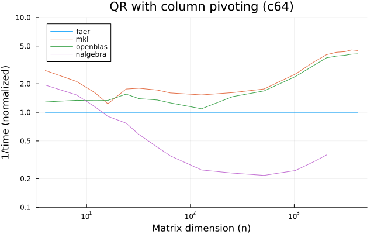

---

---

---

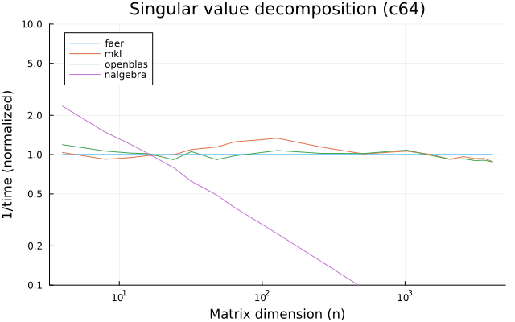

---

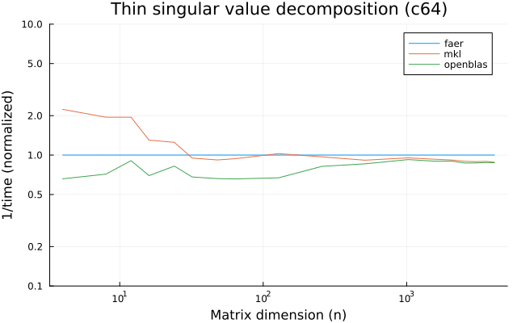

---

---

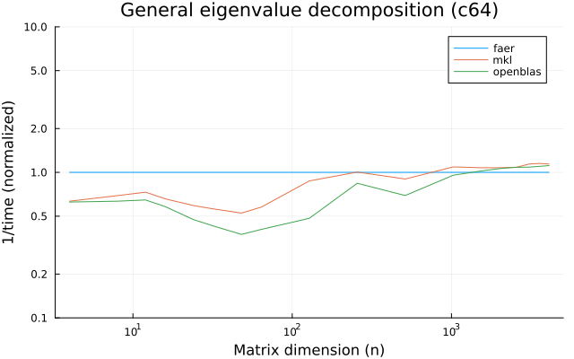

---

